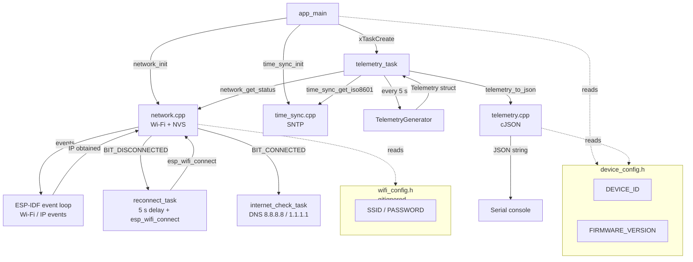

# IoTEdgeConnect Firmware

ESP32 firmware for the IoTEdgeConnect edge device platform.

This repository contains the firmware component of IoTEdgeConnect — an incremental,
production-oriented IoT platform built on ESP-IDF and AWS IoT Core. The platform is
developed phase by phase, with each milestone fully functional before the next begins.
Phase 2 adds Wi-Fi connectivity, DHCP, SNTP time synchronisation, and network status
reporting to the Phase 1 telemetry foundation.

---

## Current Functionality (Phase 2)

- ESP-IDF application targeting the ESP32
- Simulated environmental telemetry (temperature, humidity, pressure, CO₂, light, VOC, battery) with realistic drift
- FreeRTOS telemetry task using `vTaskDelayUntil` for stable 5-second intervals
- JSON serialisation via cJSON with 1 d.p. float precision
- Serial console output of compact JSON telemetry
- Startup logging of device ID and firmware version
- **Wi-Fi station-mode connectivity with automatic reconnection**
- **DHCP — IPv4 address obtained automatically**
- **RSSI reported in telemetry when connected**
- **Internet reachability check via DNS resolution against 8.8.8.8 / 1.1.1.1**
- **SNTP time synchronisation — UTC wall-clock time via `pool.ntp.org`**
- **ISO 8601 UTC timestamps in telemetry once time is valid**
- **Timestamp omitted (not faked) before SNTP synchronisation**
- **Telemetry continues uninterrupted during Wi-Fi outages**
- Host-side unit tests runnable without hardware
- Automated CI build on every push and pull request

---

## Wi-Fi Configuration

> **Real credentials must never be committed to this repository.**

Wi-Fi credentials are supplied via a local, untracked header file.

### Setup

1. Copy the example template:

   ```cmd
   copy main\config\wifi_config.example.h main\config\wifi_config.h
   ```

2. Edit `main\config\wifi_config.h` and replace the placeholder values:

   ```cpp
   constexpr const char* SSID     = "your_network_name";
   constexpr const char* PASSWORD = "your_password";
   ```

3. Build as normal. `wifi_config.h` is listed in `.gitignore` and will never be staged.

`wifi_config.h` is required to compile the firmware. CI uses the placeholder values
from `wifi_config.example.h` — sufficient to verify the build compiles correctly
without requiring real credentials.

---

## Quick Start

### First time

```cmd
scripts\run.cmd setup
```

Installs all dependencies automatically: MSYS2/g++, ESP-IDF, toolchains, usbipd-win.

### Wi-Fi credentials (required before first build)

```cmd
copy main\config\wifi_config.example.h main\config\wifi_config.h
```

Then edit `main\config\wifi_config.h` with your SSID and password.

### Build, flash and monitor

```cmd
scripts\run.cmd build
scripts\run.cmd flash_monitor
```

`build` runs the host-side unit tests before compiling. `flash_monitor` auto-detects
the ESP32 COM port.

### Manual idf.py workflow

```bash
# Activate ESP-IDF first
. $IDF_PATH/export.sh          # Linux / macOS
# $IDF_PATH\export.ps1         # Windows PowerShell

idf.py set-target esp32
idf.py build
idf.py -p <PORT> flash monitor
```

---

## Example Output

Startup:

```
I (...) IOTEDGE:  IoTEdgeConnect firmware starting
I (...) IOTEDGE:  Device: esp32-dev-001
I (...) IOTEDGE:  Firmware: 0.2.0
I (...) IOTEDGE:  Telemetry interval: 5000 ms
I (...) NETWORK:  Initialising Wi-Fi
I (...) NETWORK:  Connecting to MyNetwork
I (...) NETWORK:  Wi-Fi connected
I (...) NETWORK:  IPv4 address: 192.168.1.42
I (...) NETWORK:  Gateway:      192.168.1.1
I (...) NETWORK:  Netmask:      255.255.255.0
I (...) TIME:     Starting SNTP synchronisation
I (...) TIME:     Time synchronised
I (...) TIME:     Current UTC time: 2026-09-26T19:45:32Z
```

Telemetry (connected, time valid):

```
{"schema_version":1,"device_id":"esp32-dev-001","sequence":1,"timestamp":"2026-09-26T19:45:37Z","uptime_ms":5032,"simulated":true,"network":{"connected":true,"internet":true,"ip":"192.168.1.42","rssi_dbm":-57},"measurements":{"temperature_c":22.1,"humidity_pct":50.4,"pressure_hpa":1013.25,"co2_ppm":401,"light_lux":492.3,"voc_index":102,"battery_mv":4199}}
```

Telemetry before SNTP synchronisation (timestamp omitted):

```
{"schema_version":1,"device_id":"esp32-dev-001","sequence":1,"uptime_ms":5032,"simulated":true,"network":{"connected":false,"internet":false},"measurements":{"temperature_c":22.1,"humidity_pct":50.4,"pressure_hpa":1013.25,"co2_ppm":401,"light_lux":492.3,"voc_index":102,"battery_mv":4199}}
```

---

## System Overview



---

## Verifying Phase 2 Behaviour

### Wi-Fi connection and DHCP

After flashing, the serial monitor should show:

```
I (...) NETWORK: Wi-Fi connected
I (...) NETWORK: IPv4 address: 192.168.x.x
```

### SNTP synchronisation

```
I (...) TIME: Time synchronised
I (...) TIME: Current UTC time: 2026-09-26T...Z
```

Telemetry should then include a `"timestamp"` field.

### Disconnect / reconnect behaviour

1. Disable your Wi-Fi access point (or move the ESP32 out of range).
2. Confirm the serial monitor shows a disconnection warning and reconnect attempt.
3. Confirm telemetry continues with `"connected":false`, `"internet":false`, and no `"ip"` or `"rssi_dbm"`.
4. Re-enable the access point.
5. Confirm the ESP32 reconnects automatically.
6. Confirm `"connected":true`, `"internet":true`, `"ip"`, and `"rssi_dbm"` return in telemetry.
7. Confirm timestamps remain valid (SNTP does not need to re-sync immediately).

### Reboot behaviour

1. Reboot the ESP32.
2. Confirm `uptime_ms` resets to near zero.
3. Confirm `sequence` resets to 1.
4. Confirm Wi-Fi reconnects and SNTP re-synchronises.
5. Confirm valid UTC timestamps resume after synchronisation.

---

## Documentation

| Document | Description |
|---|---|
| [Architecture](docs/architecture.md) | Module structure, data flow, design decisions and future extensibility |
| [Building, Flashing & Monitoring](docs/building.md) | Full build and flash instructions, scripts reference |
| [Scripts](docs/scripts.md) | All `scripts/` commands explained with usage examples |
| [WSL Usage](docs/wsl.md) | Forwarding an ESP32 from Windows to WSL via usbipd-win |
| [Testing](docs/testing.md) | Host-side unit tests, coverage and CI |
| [Roadmap](docs/roadmap.md) | Phase-by-phase development plan and design constraints |

---

## Current Limitations

Phase 2 does not provide:

- MQTT or AWS IoT Core connectivity
- AWS device certificates
- Physical sensor support
- Over-the-air (OTA) updates
- Secure boot
- EAP-TLS or enterprise Wi-Fi
- Automated device provisioning
- Persistent sequence numbers across reboots

---

## Roadmap

**Phase 3 — Cloud Connectivity**

Phase 3 will connect the physical ESP32 to AWS IoT Core using MQTT over TLS
with an individually provisioned X.509 device certificate.

---

## Requirements

- [ESP-IDF](https://docs.espressif.com/projects/esp-idf/en/latest/esp32/get-started/) v5.2 or later
- Standard ESP32 development board (no external peripherals required)
- USB cable
- Windows 10/11 (scripts tested on Windows; Linux/macOS support planned)
- A 2.4 GHz Wi-Fi access point
