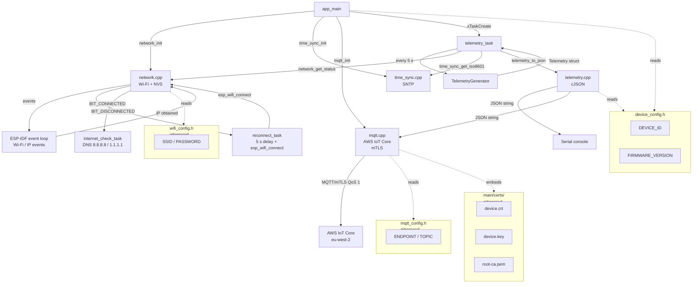

# IoTEdgeConnect Firmware

ESP32 firmware for the IoTEdgeConnect edge device platform.

This repository contains the firmware component of IoTEdgeConnect — an incremental,
production-oriented IoT platform built on ESP-IDF and AWS IoT Core. The platform is
developed phase by phase, with each milestone fully functional before the next begins.
Phase 3 adds MQTT over mTLS connectivity to AWS IoT Core, publishing the existing
telemetry to the cloud whilst retaining all Phase 1 and Phase 2 behaviour.

---

## Current Functionality (Phase 3)

- ESP-IDF application targeting the ESP32
- Simulated environmental telemetry (temperature, humidity, pressure, CO₂, light, VOC, battery) with realistic drift
- FreeRTOS telemetry task using `vTaskDelayUntil` for stable 5-second intervals
- JSON serialisation via cJSON with 1 d.p. float precision
- Serial console output of compact JSON telemetry
- Startup logging of device ID and firmware version
- Wi-Fi station-mode connectivity with automatic reconnection
- DHCP — IPv4 address obtained automatically
- RSSI reported in telemetry when connected
- Internet reachability check via DNS resolution against 8.8.8.8 / 1.1.1.1
- SNTP time synchronisation — UTC wall-clock time via `pool.ntp.org`
- ISO 8601 UTC timestamps in telemetry once time is valid
- Timestamp omitted (not faked) before SNTP synchronisation
- **MQTT over mTLS to AWS IoT Core (`eu-west-2`)**
- **X.509 device certificate authentication**
- **Telemetry published to `devices/esp32-dev-001/telemetry` at QoS 1**
- **MQTT state tracked independently of Wi-Fi state**
- **Telemetry continues uninterrupted during Wi-Fi or MQTT outages**
- **MQTT reconnects automatically after connectivity is restored**
- Host-side unit tests runnable without hardware
- Automated CI build on every push and pull request

---

## Wi-Fi Configuration

> **Real credentials must never be committed to this repository.**

Wi-Fi credentials are supplied via a local, untracked header file.

### Setup

1. Copy the example template:

   ```cmd
   copy main\config\wifi_config.example.h main\config\wifi_config.h
   ```

2. Edit `main\config\wifi_config.h` and replace the placeholder values:

   ```cpp
   constexpr const char* SSID     = "your_network_name";
   constexpr const char* PASSWORD = "your_password";
   ```

---

## AWS IoT Configuration

> **The device private key must never be committed to this repository.**

### 1. Obtain your AWS IoT endpoint

```cmd
aws iot describe-endpoint --endpoint-type iot:Data-ATS --region eu-west-2
```

### 2. Configure the endpoint

```cmd
copy main\config\mqtt_config.example.h main\config\mqtt_config.h
```

Edit `main\config\mqtt_config.h` and replace `YOUR_ENDPOINT`:

```cpp
constexpr const char* ENDPOINT    = "xxxxxxxxxxxxx-ats.iot.eu-west-2.amazonaws.com";
constexpr const char* BROKER_URI  = "mqtts://xxxxxxxxxxxxx-ats.iot.eu-west-2.amazonaws.com:8883";
```

### 3. Place certificate material

Follow the provisioning guide in the `infrastructure` repository —
[`infrastructure/docs/device-provisioning.md`](../infrastructure/docs/device-provisioning.md) —
to create the AWS IoT Thing and download the certificate material.
Then place the three files in `main\certs\`:

| File | Source |
|---|---|
| `main\certs\device.crt` | Downloaded from AWS IoT console at certificate creation |
| `main\certs\device.key` | Downloaded from AWS IoT console at certificate creation (cannot be re-downloaded) |
| `main\certs\root-ca.pem` | [Amazon Root CA 1](https://www.amazontrust.com/repository/AmazonRootCA1.pem) |

See `main\certs\README.md` for full instructions.

> The build will fail with a clear CMake error if any certificate file is absent.

---

## Quick Start

### First time

```cmd
scripts\run.cmd setup
```

### Credentials (required before first build)

```cmd
copy main\config\wifi_config.example.h main\config\wifi_config.h
copy main\config\mqtt_config.example.h main\config\mqtt_config.h
```

Edit both files, then place certificate material in `main\certs\`.

### Build, flash and monitor

```cmd
scripts\run.cmd build
scripts\run.cmd flash_monitor
```

---

## MQTT Topic Structure

| Topic | Direction | QoS |
|---|---|---|
| `devices/esp32-dev-001/telemetry` | Device → AWS IoT Core | 1 |

QoS 1 provides at-least-once delivery. Duplicate messages are possible; the
`sequence` field in the payload allows downstream consumers to detect them.
Messages generated whilst MQTT is unavailable are dropped (offline buffering
is a future phase).

---

## Example Output

Startup:

```
I (...) IOTEDGE:  IoTEdgeConnect firmware starting
I (...) IOTEDGE:  Device: esp32-dev-001
I (...) IOTEDGE:  Firmware: 0.3.0
I (...) IOTEDGE:  Telemetry interval: 5000 ms
I (...) NETWORK:  Initialising Wi-Fi
I (...) NETWORK:  Connecting to MyNetwork
I (...) NETWORK:  Wi-Fi connected
I (...) NETWORK:  IPv4 address: 192.168.1.42
I (...) TIME:     Starting SNTP synchronisation
I (...) TIME:     Time synchronised
I (...) MQTT:     Starting MQTT client
I (...) MQTT:     Endpoint: xxxxxxxxxxxxx-ats.iot.eu-west-2.amazonaws.com
I (...) MQTT:     Client ID: esp32-dev-001
I (...) MQTT:     Topic: devices/esp32-dev-001/telemetry
I (...) MQTT:     MQTT connected to xxxxxxxxxxxxx-ats.iot.eu-west-2.amazonaws.com
```

Telemetry (connected, MQTT publishing):

```
{"schema_version":1,"device_id":"esp32-dev-001","sequence":1,"timestamp":"2026-09-26T19:45:37Z","uptime_ms":5032,"simulated":true,"network":{"connected":true,"internet":true,"ip":"192.168.1.42","rssi_dbm":-57},"measurements":{"temperature_c":22.1,"humidity_pct":50.4,"pressure_hpa":1013.25,"co2_ppm":401,"light_lux":492.3,"voc_index":102,"battery_mv":4199}}
```

MQTT disconnected (serial continues):

```
W (...) MQTT:     MQTT disconnected — will reconnect automatically
D (...) IOTEDGE:  Wi-Fi: connected  MQTT: disconnected
```

---

## System Overview



---

## Failure Behaviour

| Failure | Behaviour |
|---|---|
| Wi-Fi unavailable | Telemetry continues on serial; MQTT drops; reconnect task retries every 5 s |
| MQTT disconnected | Telemetry continues on serial; ESP-IDF client reconnects automatically |
| TLS handshake fails | MQTT error logged; client retries with backoff; serial unaffected |
| AWS IoT unreachable | Same as MQTT disconnected |
| SNTP not yet synced | `timestamp` field omitted from telemetry; all other fields present |

The ESP32 never reboots due to MQTT or AWS failures.

---

## Security

> **Never commit `device.key`, `device.crt`, `root-ca.pem`, `wifi_config.h`, or `mqtt_config.h`.**

All sensitive files are listed in `.gitignore`. Removing a secret from the
working tree does not remove it from Git history — if a real credential is
accidentally committed, treat it as compromised and revoke it immediately.

---

## Documentation

| Document | Description |
|---|---|
| [Architecture](docs/architecture.md) | Module structure, data flow, design decisions and future extensibility |
| [Building, Flashing & Monitoring](docs/building.md) | Full build and flash instructions, scripts reference |
| [Scripts](docs/scripts.md) | All `scripts/` commands explained with usage examples |
| [WSL Usage](docs/wsl.md) | Forwarding an ESP32 from Windows to WSL via usbipd-win |
| [Testing](docs/testing.md) | Host-side unit tests, coverage and CI |
| [Roadmap](docs/roadmap.md) | Phase-by-phase development plan and design constraints |
| [Certificate Setup](main/certs/README.md) | Placing device credentials for the firmware build |
| [Infrastructure README](../infrastructure/README.md) | AWS-side infrastructure: Terraform, IoT policy, provisioning |

---

## Current Limitations

Phase 3 does not provide:

- Offline MQTT buffering (messages during outages are dropped)
- Device Shadows
- Remote commands
- AWS IoT Rules / downstream routing
- Physical sensor support
- Over-the-air (OTA) updates
- Secure Boot
- EAP-TLS or enterprise Wi-Fi
- Fleet Provisioning
- Persistent sequence numbers across reboots

---

## Roadmap

**Phase 4 — Real Sensors**

Phase 4 will replace `TelemetryGenerator` with a real hardware sensor driver
(e.g. SHT31 for temperature/humidity). The task, serialiser, and MQTT transport
are unchanged — this is the payoff of the transport-agnostic design.

---

## Requirements

- [ESP-IDF](https://docs.espressif.com/projects/esp-idf/en/latest/esp32/get-started/) v5.2 or later
- Standard ESP32 development board (no external peripherals required)
- USB cable
- Windows 10/11 (scripts tested on Windows; Linux/macOS support planned)
- A 2.4 GHz Wi-Fi access point
- An AWS account with IoT Core access in `eu-west-2`
- A provisioned AWS IoT Thing with an active X.509 certificate
