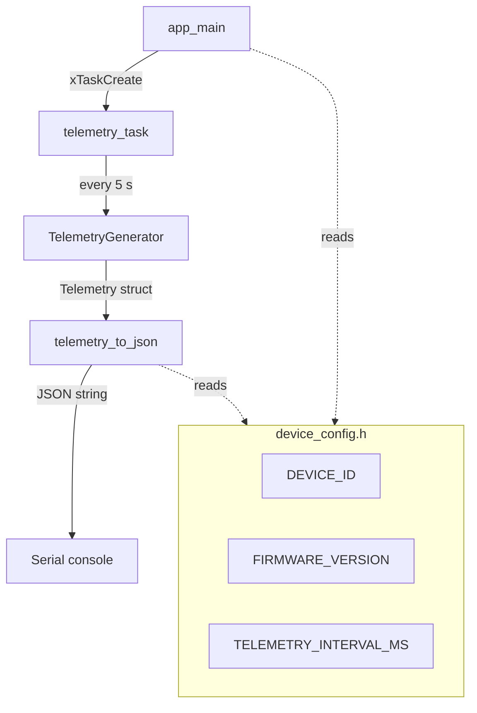

# IoTEdgeConnect Firmware

ESP32 firmware for the IoTEdgeConnect edge device platform.

This repository contains the firmware component of IoTEdgeConnect — an incremental,
production-oriented IoT platform built on ESP-IDF and AWS IoT Core. The platform is
developed phase by phase, with each milestone fully functional before the next begins.
Phase 1 establishes the core application structure and produces observable simulated
telemetry over the serial console.

---

## Current Functionality (Phase 1)

- ESP-IDF application targeting the ESP32
- Simulated environmental telemetry (temperature & humidity) with realistic drift
- FreeRTOS telemetry task using `vTaskDelayUntil` for stable 5-second intervals
- JSON serialisation via cJSON with 1 d.p. float precision
- Serial console output of compact JSON telemetry
- Startup logging of device ID and firmware version
- Host-side unit tests (1 014 assertions) runnable without hardware
- Automated CI build on every push and pull request

---

## Quick Start

### First time

```cmd
scripts\run.cmd setup
```

Installs all dependencies automatically: MSYS2/g++, ESP-IDF, toolchains, usbipd-win.

### Build, flash and monitor

```cmd
scripts\run.cmd build
scripts\run.cmd flash_monitor
```

`build` runs the host-side unit tests before compiling. `flash_monitor` auto-detects
the ESP32 COM port.

### Manual idf.py workflow

```bash
# Activate ESP-IDF first
. $IDF_PATH/export.sh          # Linux / macOS
# $IDF_PATH\export.ps1         # Windows PowerShell

idf.py set-target esp32
idf.py build
idf.py -p <PORT> flash monitor
```

---

## Example Output

```
I (...) IOTEDGE: IoTEdgeConnect firmware starting
I (...) IOTEDGE: Device: esp32-dev-001
I (...) IOTEDGE: Firmware: 0.1.0
I (...) IOTEDGE: Telemetry interval: 5000 ms

{"schema_version":1,"device_id":"esp32-dev-001","sequence":1,"uptime_ms":5042,"simulated":true,"measurements":{"temperature_c":21.8,"humidity_pct":49.2}}
{"schema_version":1,"device_id":"esp32-dev-001","sequence":2,"uptime_ms":10042,"simulated":true,"measurements":{"temperature_c":22.0,"humidity_pct":50.2}}
{"schema_version":1,"device_id":"esp32-dev-001","sequence":3,"uptime_ms":15042,"simulated":true,"measurements":{"temperature_c":21.8,"humidity_pct":49.5}}
```

---

## System Overview



---

## Documentation

| Document | Description |
|---|---|
| [Architecture](docs/architecture.md) | Module structure, data flow, design decisions and future extensibility |
| [Building, Flashing & Monitoring](docs/building.md) | Full build and flash instructions, scripts reference |
| [Scripts](docs/scripts.md) | All `scripts/` commands explained with usage examples |
| [WSL Usage](docs/wsl.md) | Forwarding an ESP32 from Windows to WSL via usbipd-win |
| [Testing](docs/testing.md) | Host-side unit tests, coverage and CI |
| [Roadmap](docs/roadmap.md) | Phase-by-phase development plan and design constraints |

---

## Current Limitations

Phase 1 does not provide:

- Wi-Fi or network connectivity
- NTP or wall-clock timestamps
- MQTT or AWS IoT Core connectivity
- Physical sensor support
- Over-the-air (OTA) updates
- Secure boot
- Automated device provisioning
- Persistent sequence numbers across reboots

---

## Roadmap

**Phase 2 — Network & Time**

Connect the device to Wi-Fi, obtain network information and synchronise
wall-clock time using NTP.

---

## Requirements

- [ESP-IDF](https://docs.espressif.com/projects/esp-idf/en/latest/esp32/get-started/) v5.2 or later
- Standard ESP32 development board (no external peripherals required for Phase 1)
- USB cable
- Windows 10/11 (scripts tested on Windows; Linux/macOS support planned)
