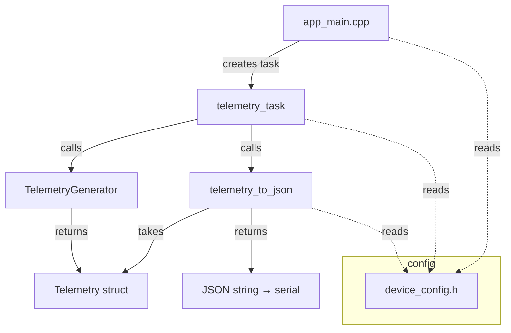
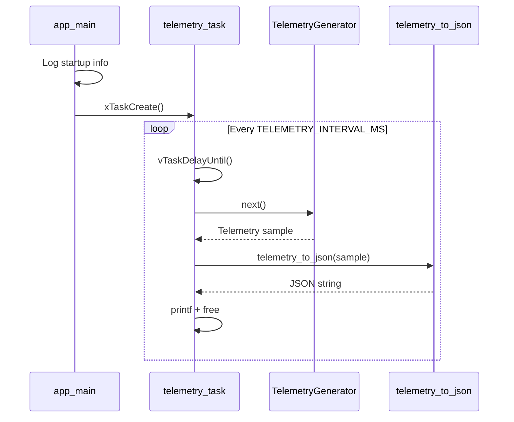
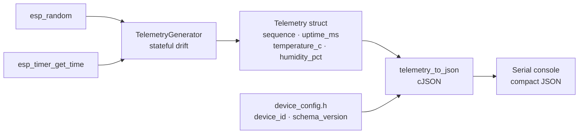

# Architecture

## Overview

IoTEdgeConnect firmware is a minimal ESP-IDF application targeting the ESP32.
Phase 1 establishes the core structure: a FreeRTOS telemetry task that generates
simulated environmental data and emits it as JSON over the serial console.

The design deliberately separates concerns so that later phases can replace the
simulated data source with real hardware sensors without restructuring the application.

---

## Module Structure



---

## FreeRTOS Task Flow



---

## Data Flow



---

## Key Design Decisions

| Decision | Rationale |
|---|---|
| `Telemetry` struct is transport-agnostic | Allows the same struct to be used with MQTT, HTTP or any future transport without modification |
| `telemetry_to_json` is a free function, not a method | Keeps serialisation separate from data; the struct has no knowledge of JSON |
| `TelemetryGenerator` holds state | Produces realistic drift rather than uncorrelated random values each sample |
| `vTaskDelayUntil` rather than `vTaskDelay` | Keeps the reporting interval stable regardless of processing time |
| cJSON via ESP-IDF `json` component | Supported, well-tested, already present in the IDF; no extra dependency |
| Single FreeRTOS task | Sufficient for Phase 1; avoids premature complexity |

---

## File Layout

```
firmware/
├── .amazonq/rules/project.md   ← workspace rules
├── .github/workflows/ci.yml    ← CI build
├── CMakeLists.txt              ← top-level ESP-IDF project
├── sdkconfig.defaults          ← default SDK options
├── main/
│   ├── CMakeLists.txt
│   ├── app_main.cpp            ← entry point, task creation
│   ├── config/
│   │   └── device_config.h     ← device ID, version, interval
│   └── telemetry/
│       ├── telemetry.h         ← Telemetry struct + serialisation declaration
│       ├── telemetry.cpp       ← JSON serialisation (cJSON)
│       ├── telemetry_generator.h
│       └── telemetry_generator.cpp  ← stateful simulated data
└── tests/
    └── test_telemetry.cpp      ← host-side unit tests
```
