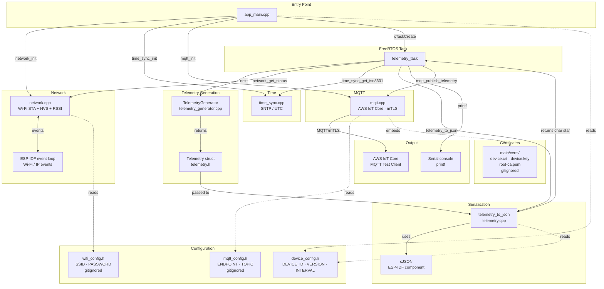
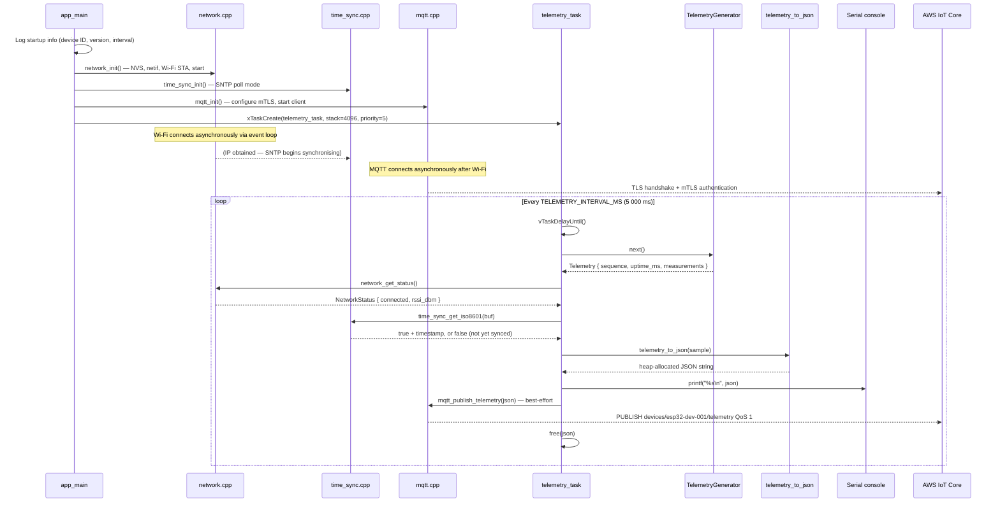
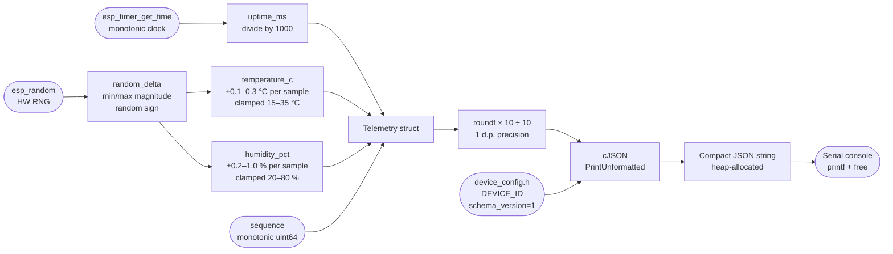
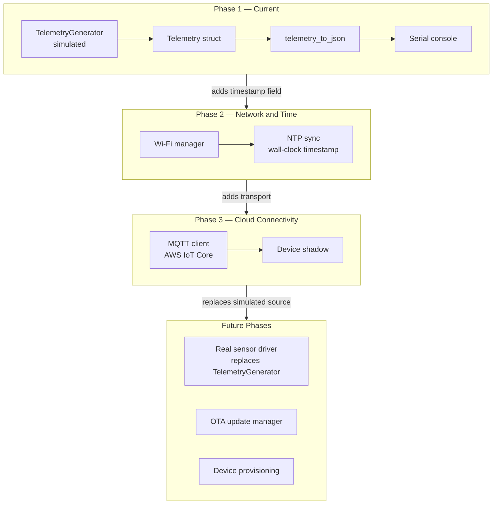

# Architecture

## Overview

IoTEdgeConnect firmware is a minimal ESP-IDF application targeting the ESP32.
It is designed to grow incrementally — each phase adds a well-defined capability
without requiring the existing structure to be rewritten.

Phase 1 establishes the foundational layer: a FreeRTOS telemetry task that generates
simulated environmental data and emits it as JSON over the serial console. Every
subsequent phase builds on top of this layer rather than replacing it.

---

## Guiding Principles

The architecture is governed by three rules that apply across all phases:

1. **Separation of concerns** — data generation, serialisation, and transport are
   independent. Replacing one does not require touching the others.
2. **Transport agnosticism** — the `Telemetry` struct carries measurements only.
   It has no knowledge of JSON, MQTT, HTTP, or any other transport.
3. **Incremental extension** — new capabilities are added as new modules. Existing
   modules are not restructured to accommodate them.

---

## Current Module Structure (Phase 3)



---

## File Layout

```
firmware/
├── CMakeLists.txt                  Top-level ESP-IDF project
├── sdkconfig.defaults              Default SDK configuration
│
├── main/
│   ├── CMakeLists.txt              Component registration + certificate embedding
│   ├── app_main.cpp                Entry point; init network/time/mqtt, create telemetry task
│   │
│   ├── certs/                      Local certificate material — gitignored, never committed
│   │   ├── README.md               Instructions for obtaining and placing certificates
│   │   ├── device.crt              Device certificate (download from AWS IoT console)
│   │   ├── device.key              Device private key (download once at creation)
│   │   └── root-ca.pem             Amazon Root CA 1
│   │
│   ├── config/
│   │   ├── device_config.h         Device identity, firmware version, telemetry interval
│   │   ├── wifi_config.example.h   Committed template — placeholder credentials only
│   │   ├── wifi_config.h           Local Wi-Fi credentials — gitignored, never committed
│   │   ├── mqtt_config.example.h   Committed template — placeholder endpoint only
│   │   └── mqtt_config.h           Local AWS IoT endpoint config — gitignored, never committed
│   │
│   ├── network/
│   │   ├── network.h               Public API: network_init(), network_get_status()
│   │   └── network.cpp             Wi-Fi STA, NVS init, event handler, reconnection
│   │
│   ├── mqtt/
│   │   ├── mqtt.h                  Public API: mqtt_init(), mqtt_publish_telemetry(), mqtt_is_connected()
│   │   └── mqtt.cpp                ESP-IDF MQTT client, mTLS, AWS IoT Core connection lifecycle
│   │
│   ├── time_sync/
│   │   ├── time_sync.h             Public API: time_sync_init(), is_valid(), get_iso8601()
│   │   └── time_sync.cpp           SNTP initialisation and UTC timestamp formatting
│   │
│   └── telemetry/
│       ├── telemetry.h             Telemetry struct + telemetry_to_json declaration
│       ├── telemetry.cpp           JSON serialisation via cJSON
│       ├── telemetry_generator.h   TelemetryGenerator class declaration
│       └── telemetry_generator.cpp Stateful simulated data generation
│
├── tests/
│   ├── stubs/                      Host-side ESP-IDF header stubs
│   │   ├── esp_log.h               No-op logging macros
│   │   ├── esp_random.h            Declares esp_random()
│   │   └── esp_timer.h             Declares esp_timer_get_time()
│   └── test_telemetry.cpp          Host-side unit tests
│
├── scripts/                        Developer convenience scripts
│   └── ...                         See docs/scripts.md
│
└── .github/workflows/ci.yml        CI: host tests + firmware build
```

---

## FreeRTOS Task Flow



---

## Data Flow



---

## The Telemetry Struct

```cpp
struct Telemetry {
    uint64_t sequence;          // monotonically increasing, resets on reboot
    int64_t  uptime_ms;         // milliseconds since boot
    char     timestamp_utc[21]; // ISO 8601 UTC; empty string before SNTP sync
    bool     net_connected;     // current Wi-Fi connection state
    int8_t   net_rssi_dbm;      // RSSI; valid only when net_connected == true
    float    temperature_c;
    float    humidity_pct;
    float    pressure_hpa;
    float    co2_ppm;
    float    light_lux;
    float    voc_index;
    float    battery_mv;
};
```

The struct remains transport-agnostic. Network and time fields are populated by
the telemetry task from the network and time_sync modules — the generator itself
has no knowledge of Wi-Fi or clocks beyond `esp_timer_get_time`.

---

## JSON Schema (v1)

```json
{
  "schema_version": 1,
  "device_id":      "esp32-dev-001",
  "sequence":       42,
  "timestamp":      "2026-09-26T19:45:32Z",
  "uptime_ms":      210000,
  "simulated":      true,
  "network": {
    "connected": true,
    "rssi_dbm":  -57
  },
  "measurements": {
    "temperature_c": 22.4,
    "humidity_pct":  53.1,
    "pressure_hpa":  1013.25,
    "co2_ppm":       412,
    "light_lux":     487.5,
    "voc_index":     103,
    "battery_mv":    4150
  }
}
```

`timestamp` is omitted entirely before SNTP synchronisation. `rssi_dbm` is omitted
from the `network` object when `connected` is `false`.

| Field | Type | Precision | Notes |
|---|---|---|---|
| `schema_version` | integer | — | Always `1` |
| `device_id` | string | — | From `config::DEVICE_ID` |
| `sequence` | integer | — | Resets to 1 on reboot |
| `timestamp` | string | — | ISO 8601 UTC; omitted before SNTP sync |
| `uptime_ms` | integer | — | Milliseconds since boot |
| `simulated` | boolean | — | `true` while using `TelemetryGenerator` |
| `network.connected` | boolean | — | Current Wi-Fi connection state |
| `network.rssi_dbm` | integer | — | RSSI dBm; present only when connected |
| `temperature_c` | float | 1 d.p. | Degrees Celsius, range 15–35 |
| `humidity_pct` | float | 1 d.p. | Relative humidity %, range 20–80 |
| `pressure_hpa` | float | 2 d.p. | Barometric pressure hPa, range 970–1050 |
| `co2_ppm` | float | 0 d.p. | CO₂ concentration ppm, range 350–2000 |
| `light_lux` | float | 1 d.p. | Ambient light lux, range 0–10 000 |
| `voc_index` | float | 0 d.p. | VOC index (Sensirion scale 1–500) |
| `battery_mv` | float | 0 d.p. | Battery voltage mV, drains from 4200 to 3000 |

---

## Key Design Decisions

| Decision | Rationale |
|---|---|
| `Telemetry` struct is transport-agnostic | The same struct is passed to any serialiser or transport without modification |
| `telemetry_to_json` is a free function | Serialisation is separate from data; the struct has no knowledge of JSON |
| `TelemetryGenerator` holds state | Produces realistic drift rather than uncorrelated random values each sample |
| `vTaskDelayUntil` not `vTaskDelay` | Keeps the reporting interval stable regardless of how long serialisation takes |
| cJSON via ESP-IDF `json` component | Already present in the IDF; no extra dependency to manage |
| Single FreeRTOS task | Sufficient for Phase 1; avoids premature complexity |
| `simulated: true` flag in JSON | Allows the platform to distinguish test data from real sensor data at ingestion |
| `schema_version: 1` in JSON | Enables schema evolution without breaking consumers |
| Float rounded to 1 d.p. | cJSON's default double formatting produces excessive precision (e.g. `21.830028533935547`) |
| MQTT QoS 1 | At-least-once delivery; acceptable for telemetry. Duplicates are detectable via `sequence`. QoS 2 adds round-trip overhead not justified at this stage |
| Certificates embedded via `target_add_binary_data` | ESP-IDF idiomatic approach; files are baked into the binary at build time, not read from flash at runtime |
| MQTT state tracked separately from Wi-Fi state | Wi-Fi connected ≠ MQTT connected; AWS/TLS failures must not be conflated with network failures |
| MQTT failure does not stop telemetry | Core telemetry task must remain operational regardless of cloud connectivity |
| ESP-IDF MQTT client built-in reconnect | Avoids a manual reconnect loop; the client handles exponential backoff automatically |

---

## Extensibility: How Future Phases Plug In

The architecture is designed so that each new phase adds a module rather than
modifying existing ones. The diagram below shows the intended growth path.



**Phase 2** adds a Wi-Fi manager (`network.cpp`) and SNTP client (`time_sync.cpp`).
The `Telemetry` struct gains `timestamp_utc`, `net_connected`, and `net_rssi_dbm`.
`telemetry_to_json` is updated to serialise them. The generator, task structure,
and serial output are otherwise unchanged.

**Phase 3** adds an MQTT transport. `telemetry_to_json` output is published to
AWS IoT Core instead of (or in addition to) the serial console. The generator
and struct are unchanged.

**Future phases** replace `TelemetryGenerator` with a real sensor driver. Because
the generator and the task are separate, only the generator is swapped out. The
task, serialiser, and transport are unaffected.
