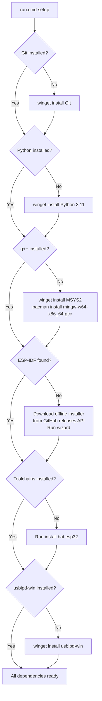
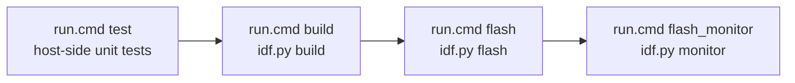

# Building, Flashing & Monitoring

## Prerequisites

| Tool | Version | Notes |
|---|---|---|
| Git | any | [git-scm.com](https://git-scm.com) |
| Python | any | Required by ESP-IDF; the offline installer bundles its own |
| MSYS2 + g++ | any | For host-side unit tests; installed by `setup` |
| ESP-IDF | v5.2 or later | Installed by `setup` to `C:\Espressif` |
| CMake + Ninja | — | Bundled with the ESP-IDF offline installer |
| usbipd-win | ≥ 4.0 | Windows only; for WSL USB forwarding |

---

## First-time Setup

Run once after cloning. Checks and installs all dependencies automatically:

```cmd
scripts\run.cmd setup
```



The setup script is idempotent — each step checks before acting, so re-running
it after a partial install will complete the remaining steps without repeating
completed ones.

The ESP-IDF offline installer is resolved dynamically from the
[espressif/idf-installer](https://github.com/espressif/idf-installer/releases)
GitHub releases API, so it always fetches the latest stable version without
any hardcoded URLs in the script.

---

## Build Workflow



`run.cmd build` automatically runs the host-side tests before invoking
`idf.py build`. If the tests fail, the firmware build is aborted.

---

## Scripts Reference

All scripts are in `scripts/` and invoked via `scripts\run.cmd <command>`.
See [Scripts](scripts.md) for full documentation.

| Command | Action |
|---|---|
| `run.cmd setup` | Install all dependencies |
| `run.cmd test` | Run host-side unit tests |
| `run.cmd build` | Run tests then build firmware |
| `run.cmd flash` | Flash to auto-detected ESP32 |
| `run.cmd monitor` | Open serial monitor |
| `run.cmd flash_monitor` | Flash then monitor |
| `run.cmd wsl_attach` | Forward ESP32 USB to WSL |
| `run.cmd wsl_detach` | Return ESP32 USB to Windows |

---

## Manual idf.py Commands

If you prefer to invoke `idf.py` directly, activate ESP-IDF first:

```powershell
# PowerShell
. C:\Espressif\frameworks\esp-idf-v5.2.8\export.ps1

# cmd.exe
C:\Espressif\frameworks\esp-idf-v5.2.8\export.bat
```

### Set target (once per checkout)

```bash
idf.py set-target esp32
```

### Build

```bash
idf.py build
```

### Flash

```bash
idf.py -p <PORT> flash
```

Replace `<PORT>` with your serial port:

- Windows: `COM3`
- Linux: `/dev/ttyUSB0`
- macOS: `/dev/cu.usbserial-0001`

### Monitor

```bash
idf.py -p <PORT> monitor
```

Press `Ctrl+]` to exit.

### Flash and monitor in one step

```bash
idf.py -p <PORT> flash monitor
```

### Clean

```bash
idf.py fullclean
```

Removes the `build/` directory entirely. Re-run `set-target` afterwards.

---

## SDK Configuration

Default SDK options are in [`sdkconfig.defaults`](../sdkconfig.defaults).
The generated `sdkconfig` file is excluded from version control.

Key defaults:

| Setting | Value | Reason |
|---|---|---|
| `CONFIG_ESP_CONSOLE_UART_BAUDRATE` | 115200 | Standard serial monitor baud rate |
| `CONFIG_LOG_DEFAULT_LEVEL` | INFO | Avoids debug noise in normal operation |
| `CONFIG_BT_ENABLED` | n | Bluetooth not required; reduces binary size |

To open the interactive configuration menu:

```bash
idf.py menuconfig
```

---

## WSL

To build, flash and monitor from inside WSL, see [WSL Usage](wsl.md).
