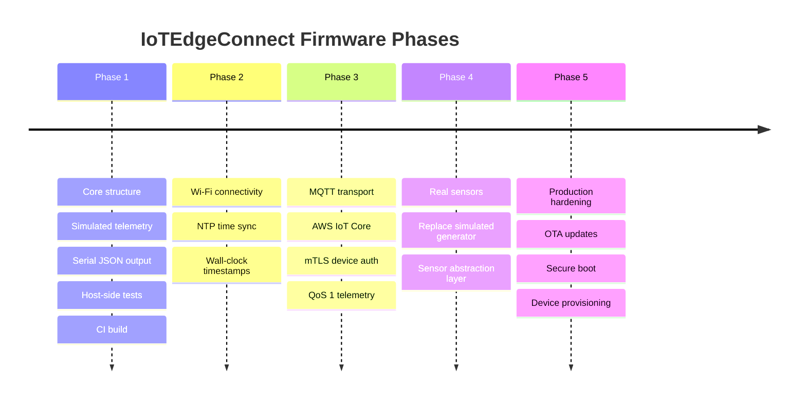

# Roadmap

IoTEdgeConnect is developed incrementally. Each phase is fully functional
before the next begins. No phase speculatively implements future functionality.

---

## Phase Overview

---

## Phase 1 — Core Structure (Complete)

**Goal:** Establish the application structure and produce observable telemetry.

**Delivered:**

- ESP-IDF application targeting the ESP32
- `Telemetry` struct — transport-agnostic data model
- `TelemetryGenerator` — stateful simulated environmental data
- `telemetry_to_json` — cJSON serialisation, 1 d.p. float precision
- FreeRTOS telemetry task with `vTaskDelayUntil` for stable 5-second intervals
- Serial console JSON output
- Host-side unit tests (1 014 assertions) with ESP-IDF stubs
- GitHub Actions CI: host tests + firmware build
- Developer scripts: setup, test, build, flash, monitor, WSL attach/detach

**Verified on hardware:** ESP32-D0WD-V3 (revision v3.1), ESP-IDF v5.2.8.

**What Phase 1 deliberately does not include:**

- Wi-Fi, NTP, MQTT, AWS IoT Core
- Physical sensors
- OTA, secure boot, provisioning
- Persistent sequence numbers

---

## Phase 2 — Network & Time (Complete)

**Goal:** Connect the device to Wi-Fi and synchronise wall-clock time via NTP.

**Delivered:**

- `network.cpp` — Wi-Fi STA mode, NVS initialisation, event-driven reconnection, RSSI query
- `time_sync.cpp` — SNTP client, UTC-only, ISO 8601 timestamp formatting
- `Telemetry` struct extended: `timestamp_utc`, `net_connected`, `net_rssi_dbm`
- `telemetry_to_json` updated: `timestamp` omitted before sync, `network` object, `rssi_dbm` conditional
- Wi-Fi credentials via gitignored `wifi_config.h` (template committed as `wifi_config.example.h`)
- CI generates placeholder `wifi_config.h` from the example; no real credentials in CI

**What Phase 2 does not include:**

- MQTT or cloud connectivity
- Real sensors
- OTA

---

## Phase 3 — Cloud Connectivity (Complete)

**Goal:** Publish telemetry to AWS IoT Core via MQTT over mTLS.

**Delivered:**

- `mqtt.cpp` — ESP-IDF MQTT client, mTLS, AWS IoT Core connection lifecycle
- Device certificate, private key, and root CA embedded at build time via `target_add_binary_data`
- Certificate material in `main/certs/` — gitignored, never committed
- `mqtt_config.h` — account-specific endpoint config, gitignored (template committed as `mqtt_config.example.h`)
- Telemetry published to `devices/esp32-dev-001/telemetry` at QoS 1
- Serial output retained alongside MQTT for debugging
- MQTT state tracked independently of Wi-Fi state
- Telemetry continues uninterrupted if MQTT is unavailable
- MQTT reconnects automatically via ESP-IDF client built-in backoff
- Firmware version bumped to `0.3.0`
- CI generates placeholder certificate stubs from `tests/certs/`

**What Phase 3 does not include:**

- Device Shadows
- Remote commands
- Offline MQTT buffering (messages generated during outages are dropped)
- Real sensors
- OTA
- Fleet Provisioning

---

## Phase 4 — Real Sensors

**Goal:** Replace the simulated generator with a real hardware sensor driver.

**Planned additions:**

- I²C or SPI sensor driver (e.g. SHT31 for temperature/humidity)
- Sensor abstraction layer so multiple sensor types can be supported
- `TelemetryGenerator` replaced by `SensorReader` implementing the same interface
- `simulated: false` in JSON output

**Architecture impact:**

`TelemetryGenerator` is replaced. The task, serialiser, and transport are
unchanged — this is the payoff of the transport-agnostic design established
in Phase 1.

---

## Phase 5 — Production Hardening

**Goal:** Prepare the device for production deployment.

**Planned additions:**

- Over-the-air (OTA) firmware updates via AWS IoT Jobs
- Secure boot and flash encryption
- Automated device provisioning (fleet provisioning or JITP)
- Persistent sequence numbers via NVS
- Watchdog and error recovery

---

## Design Constraints Across All Phases

These constraints apply to every phase and must not be violated:

| Constraint | Reason |
|---|---|
| `Telemetry` struct remains transport-agnostic | Any transport can consume it without modification |
| No credentials committed to the repository | Public repository; all secrets via `sdkconfig` or AWS IoT provisioning |
| Each phase must be fully functional before the next begins | Prevents half-finished features accumulating |
| New capabilities are added as new modules | Existing modules are not restructured to accommodate new phases |
| Firmware version defined once in `device_config.h` | Single source of truth; no scattered version strings |
