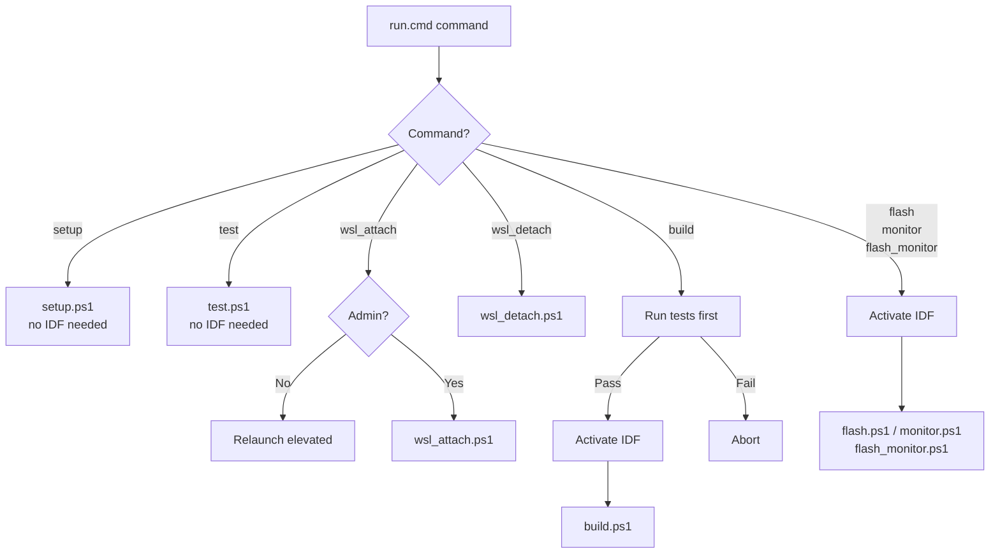

# Scripts

All developer scripts live in `scripts/` and are invoked through the
`scripts\run.cmd` launcher, which handles PowerShell execution policy,
IDF activation, and elevation automatically.

---

## Launcher: run.cmd

`run.cmd` is the single entry point for all scripts. It is a plain `.cmd`
file so Windows runs it without any execution policy restrictions.

```cmd
scripts\run.cmd <command> [args]
```



### IDF activation

When `IDF_PATH` is not set, `run.cmd` calls `_idf_env.ps1` to locate the
ESP-IDF installation and set three environment variables before calling
`export.bat`:

| Variable | Example value | Purpose |
|---|---|---|
| `IDF_PATH` | `C:\Espressif\frameworks\esp-idf-v5.2.8` | IDF source root |
| `IDF_TOOLS_PATH` | `C:\Espressif` | Toolchain and venv root |
| `IDF_PYTHON_ENV_PATH` | `C:\Espressif\python_env\idf5.2_py3.11_env` | Python venv |

The detection is dynamic — it searches known install locations and walks the
directory tree, so it works regardless of which installer was used or where
the user chose to install.

---

## setup.ps1

Installs all dependencies. Safe to re-run — each step checks before acting.

```cmd
scripts\run.cmd setup
```

**Steps:**

1. Git — installs via winget if missing
2. Python — installs via winget if missing
3. C++ compiler — installs MSYS2 and `mingw-w64-x86_64-gcc` via winget/pacman if missing; adds `C:\msys64\mingw64\bin` to the user PATH
4. ESP-IDF source — resolves the latest offline installer from the GitHub releases API, downloads with progress display, verifies file size, runs the wizard
5. ESP-IDF toolchains — runs `install.bat esp32` if the Xtensa toolchain is not found
6. usbipd-win — installs via winget if missing

---

## test.ps1

Compiles and runs the host-side unit tests without requiring an ESP32 or
an activated ESP-IDF environment.

```cmd
scripts\run.cmd test
```

Adds `C:\msys64\mingw64\bin` to `$env:PATH` for the session so g++ is
available immediately after `setup` without opening a new terminal.

Expected output:

```
==> Running host-side unit tests
    Compiler: C:\msys64\mingw64\bin\g++.exe
    cJSON:    C:\Espressif\frameworks\esp-idf-v5.2.8\components\json\cJSON\cJSON.c
    Compiling...
    Running...

Results: 1014 passed, 0 failed
    PASS
```

See [Testing](testing.md) for full coverage details.

---

## build.ps1

Runs `idf.py build` from the firmware root.

```cmd
scripts\run.cmd build
```

Note: `run.cmd build` runs the host-side tests first and aborts if they fail.
The tests can be skipped by calling `build.ps1` directly, but this is not
recommended.

---

## flash.ps1

Flashes the firmware to an ESP32. Auto-detects the COM port by VID:PID.

```cmd
scripts\run.cmd flash
scripts\run.cmd flash -Port COM3
```

If multiple ESP32-compatible devices are found, the first is used and a
warning is printed. Pass `-Port` to override.

---

## monitor.ps1

Opens the IDF serial monitor. Auto-detects the COM port.

```cmd
scripts\run.cmd monitor
scripts\run.cmd monitor -Port COM3
```

Press `Ctrl+]` to exit.

---

## flash_monitor.ps1

Flashes and immediately opens the monitor. The most common command during
active development.

```cmd
scripts\run.cmd flash_monitor
scripts\run.cmd flash_monitor -Port COM3
```

---

## wsl_attach.ps1

Forwards an ESP32 USB device from Windows to WSL using usbipd-win.
Requires administrator privileges for the `usbipd bind` step — `run.cmd`
relaunches elevated automatically.

```cmd
scripts\run.cmd wsl_attach
scripts\run.cmd wsl_attach -BusId 2-3
```

Auto-detects the ESP32 by VID:PID from `usbipd list`. After attaching,
the device appears in all WSL 2 distros as `/dev/ttyUSB0` or `/dev/ttyACM0`.

See [WSL Usage](wsl.md) for the full workflow.

---

## wsl_detach.ps1

Returns the ESP32 USB device from WSL back to Windows.

```cmd
scripts\run.cmd wsl_detach
scripts\run.cmd wsl_detach -BusId 2-3
```

Auto-detects the currently attached ESP32-compatible device.

---

## _common.ps1

Shared helper dot-sourced by `flash.ps1`, `monitor.ps1` and `flash_monitor.ps1`.
Not invoked directly.

Provides:

- `Find-EspPort` — queries `Get-PnpDevice` for COM ports matching known ESP32
  VID:PID values; falls back to prompting the user
- `Assert-IdfActivated` — exits with an error if `IDF_PATH` is not set

### Recognised VID:PID values

| Chip | VID:PID | Common boards |
|---|---|---|
| Silicon Labs CP210x | `10C4:EA60` | Most Espressif DevKitC boards |
| WCH CH340 | `1A86:7523` | Budget clone boards |
| WCH CH9102 | `1A86:55D4` | Newer clone boards |
| FTDI FT232RL | `0403:6001` | Some older boards |
| FTDI FT2232 | `0403:6010` | Dual-channel boards |
| Espressif USB-CDC | `303A:1001` | ESP32-S3 / C3 native USB |

---

## _idf_env.ps1

Called by `run.cmd` to detect ESP-IDF paths and write them as `key=value`
pairs to a temporary file. Not invoked directly.

Searches the following locations in priority order:

1. `C:\Espressif\frameworks\esp-idf-v*` (offline installer default)
2. `%USERPROFILE%\esp\esp-idf` (online installer default)
3. `C:\esp\esp-idf` (common manual install)

For each candidate, it also derives the tools root and Python venv path
dynamically, so it works regardless of which installer was used.
