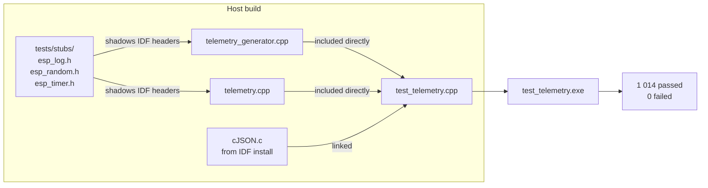
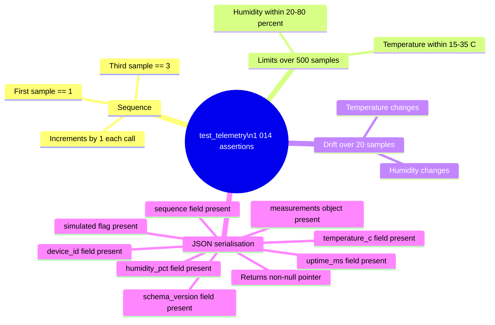
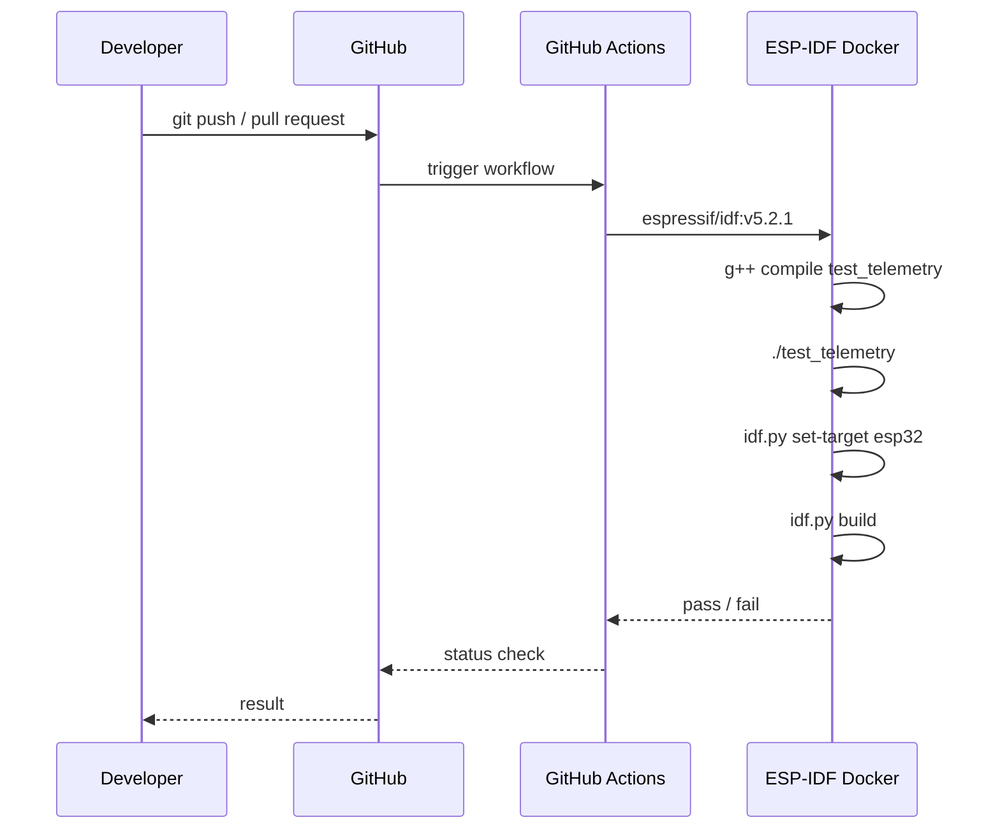

# Testing

## Approach

Phase 1 tests run on the host (your development machine) without requiring
an ESP32 or an activated ESP-IDF environment. The telemetry generation and
JSON serialisation units are compiled with stub headers that replace the
ESP-IDF dependencies.



### Stubs

| Header | Stub behaviour |
|---|---|
| `esp_random.h` | Declares `esp_random()` — implemented in the test file using a seeded `std::mt19937` for deterministic, reproducible results |
| `esp_timer.h` | Declares `esp_timer_get_time()` — implemented in the test file, advancing by 5 000 000 µs per call |
| `esp_log.h` | No-op macros for `ESP_LOGI`, `ESP_LOGW`, `ESP_LOGE` |

The stubs directory is placed before the IDF include path so the stub headers
shadow the real ones without modifying any source files.

---

## Running the Tests

```cmd
scripts\run.cmd test
```

Or directly with g++:

```bash
g++ -std=c++17 \
    -I main \
    -I tests/stubs \
    -I $IDF_PATH/components/json/cJSON \
    $IDF_PATH/components/json/cJSON/cJSON.c \
    tests/test_telemetry.cpp \
    -o tests/test_telemetry

./tests/test_telemetry
```

Expected output:

```
Results: 1014 passed, 0 failed
```

The test binary is not committed; it is produced and cleaned up by `test.ps1`.

---

## Test Coverage



---

## Pre-build Gate

`run.cmd build` runs the tests before invoking `idf.py build`. If any test
fails, the firmware build is aborted:

```
Running tests before build...

==> Running host-side unit tests
    ...
    PASS
Activating ESP-IDF from C:\Espressif\frameworks\esp-idf-v5.2.8...
Building firmware...
```

This ensures that a logic regression in the telemetry layer is caught before
a firmware binary is produced.

---

## CI

The GitHub Actions workflow runs the host-side tests before the firmware build
on every push to `main` and every pull request.



The workflow uses the official `espressif/idf` Docker image which includes
both g++ and the full ESP-IDF toolchain, so no additional setup is required
in CI.

---

## What Is Not Tested

The following are not covered by Phase 1 tests and are validated by flashing
to hardware:

- FreeRTOS task scheduling and timing
- `vTaskDelayUntil` interval accuracy
- Serial console output
- ESP32 hardware RNG distribution
- Memory usage over extended runtime

These will be addressed as the platform matures and hardware-in-the-loop
testing infrastructure is established.
