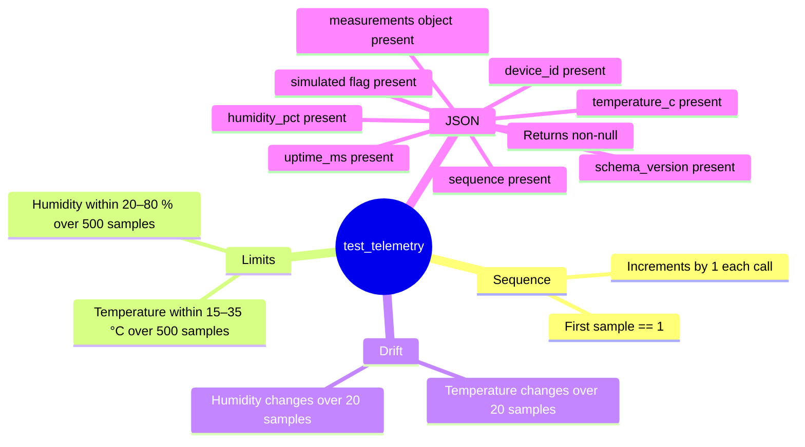

# Testing

## Approach

Phase 1 tests run on the host (your development machine) without requiring an ESP32.
The telemetry generation and JSON serialisation units are compiled with stub
implementations of the two ESP-IDF functions they depend on:

| ESP-IDF function | Stub behaviour |
|---|---|
| `esp_random()` | Seeded `std::mt19937` — deterministic, reproducible |
| `esp_timer_get_time()` | Advances by 5 000 000 µs (5 s) per call |

cJSON is compiled directly from the ESP-IDF source tree.

---

## Test Coverage



---

## Building & Running the Tests

```bash
g++ -std=c++17 \
    -I main \
    -I $IDF_PATH/components/cjson/cJSON \
    main/telemetry/telemetry_generator.cpp \
    main/telemetry/telemetry.cpp \
    $IDF_PATH/components/cjson/cJSON/cJSON.c \
    tests/test_telemetry.cpp \
    -o tests/test_telemetry

./tests/test_telemetry
```

Expected output:

```
Results: 516 passed, 0 failed
```

---

## Notes

- The test binary is not committed; `tests/test_telemetry` is covered by `.gitignore`.
- CI currently validates the ESP-IDF firmware build only. Host-side test execution
  can be added to CI in a future phase once a suitable runner image is confirmed.
