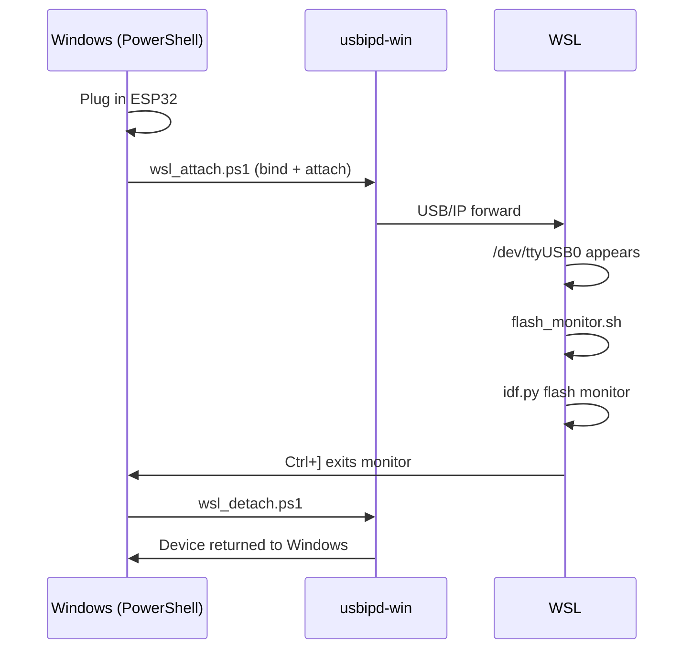

# Using an ESP32 from WSL

WSL 2 does not expose USB devices by default.
[usbipd-win](https://github.com/dorssel/usbipd-win) forwards a USB device from
Windows into a WSL distro over the USB/IP protocol, making it appear as a normal
`/dev/ttyUSB*` or `/dev/ttyACM*` device inside WSL.

---

## Prerequisites

| Component | Where | Install |
|---|---|---|
| usbipd-win ≥ 4.0 | Windows | `winget install usbipd` |
| linux-tools-generic | WSL | `scripts/wsl_setup.sh` (see below) |
| hwdata | WSL | included in `wsl_setup.sh` |

Your WSL kernel must be 5.10.60 or later — the kernel shipped with Ubuntu 24.04
on WSL 2 (`6.6.x`) satisfies this.

---

## One-time WSL Setup

Run once inside your WSL distro:

```bash
bash scripts/wsl_setup.sh
```

This installs the usbip client tools and adds your user to the `dialout` group.
Close and reopen the WSL terminal afterwards for the group change to take effect.

---

## Workflow



---

## Attaching the ESP32

From PowerShell on Windows:

```powershell
.\scripts\wsl_attach.ps1
```

The script auto-detects the ESP32 by VID:PID and attaches it to `Ubuntu-24.04`
by default. To target a different distro:

```powershell
.\scripts\wsl_attach.ps1 -Distro Ubuntu-20.04
```

To specify the bus ID manually (from `usbipd list`):

```powershell
.\scripts\wsl_attach.ps1 -BusId 2-3
```

Verify the device is visible in WSL:

```bash
ls /dev/ttyUSB* /dev/ttyACM* 2>/dev/null
```

---

## Flashing and Monitoring from WSL

```bash
./scripts/flash_monitor.sh
```

The script auto-detects `/dev/ttyUSB0` or `/dev/ttyACM0`.
Override with `PORT=/dev/ttyUSB1 ./scripts/flash_monitor.sh`.

---

## Detaching

When finished, return the device to Windows:

```powershell
.\scripts\wsl_detach.ps1
```

---

## Troubleshooting

| Symptom | Likely cause | Fix |
|---|---|---|
| `No serial device found` in WSL | Device not attached | Run `wsl_attach.ps1` |
| `Permission denied` on `/dev/ttyUSB0` | User not in `dialout` group | Run `wsl_setup.sh`, reopen terminal |
| `usbipd: command not found` on Windows | usbipd-win not installed | `winget install usbipd` |
| Device attaches but immediately disconnects | Another process holds the port | Close any open monitors on Windows |
| `bind` step fails silently | Needs elevation | Run PowerShell as Administrator for the bind step, or use `usbipd bind --busid <id>` in an elevated prompt once |

---

## Known VID:PID Values

The scripts recognise the following USB-to-serial adapters automatically:

| Chip | VID:PID | Common boards |
|---|---|---|
| Silicon Labs CP210x | `10C4:EA60` | Most Espressif DevKitC boards |
| WCH CH340 | `1A86:7523` | Budget clone boards |
| WCH CH9102 | `1A86:55D4` | Newer clone boards |
| FTDI FT232RL | `0403:6001` | Some older boards |
| FTDI FT2232 | `0403:6010` | Dual-channel boards |
| Espressif USB-CDC | `303A:1001` | ESP32-S3 / C3 native USB |
