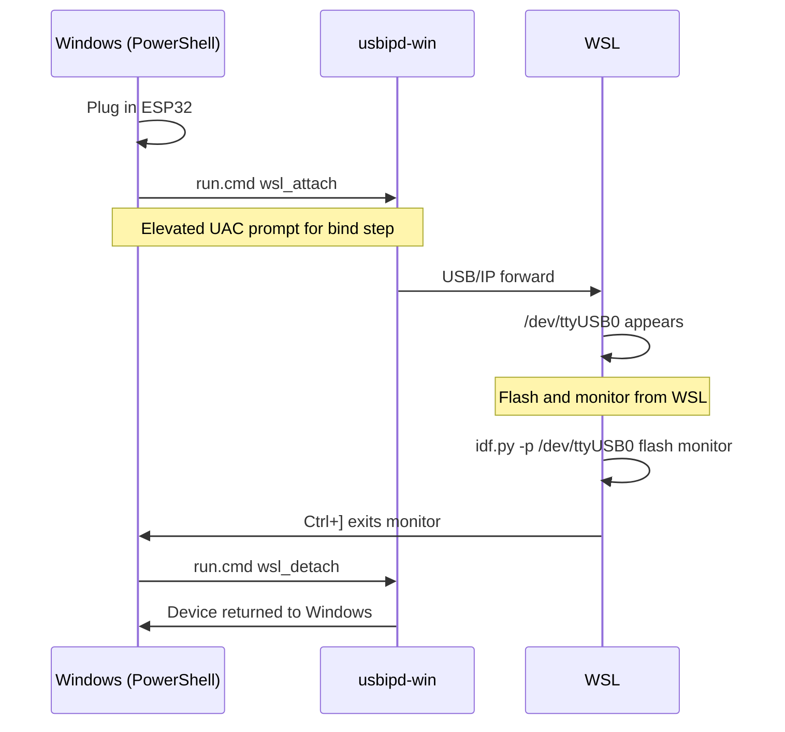

# Using an ESP32 from WSL

WSL 2 does not expose USB devices by default.
[usbipd-win](https://github.com/dorssel/usbipd-win) forwards a USB device from
Windows into WSL over the USB/IP protocol, making it appear as a normal
`/dev/ttyUSB*` or `/dev/ttyACM*` device inside WSL.

---

## Prerequisites

| Component | Where | Install |
|---|---|---|
| usbipd-win ≥ 4.0 | Windows | `winget install usbipd` or `scripts\run.cmd setup` |
| linux-tools-generic | WSL | `sudo apt install linux-tools-generic hwdata` |

Your WSL kernel must be 5.10.60 or later. The kernel shipped with Ubuntu 24.04
on WSL 2 (`6.6.x`) satisfies this.

### One-time WSL setup

Run once inside your WSL distro:

```bash
sudo apt update
sudo apt install linux-tools-generic hwdata
sudo usermod -aG dialout $USER
```

Close and reopen the WSL terminal for the group change to take effect.

---

## Workflow



---

## Attaching the ESP32

From PowerShell on Windows:

```cmd
scripts\run.cmd wsl_attach
```

The script auto-detects the ESP32 by VID:PID. `run.cmd` relaunches the script
elevated automatically — a UAC prompt will appear for the `usbipd bind` step.

To specify the bus ID manually (from `usbipd list`):

```cmd
scripts\run.cmd wsl_attach -BusId 2-3
```

Verify the device is visible in WSL:

```bash
ls /dev/ttyUSB* /dev/ttyACM* 2>/dev/null
```

---

## Flashing and Monitoring from WSL

With the device attached, use `idf.py` directly inside WSL:

```bash
# Activate ESP-IDF first
. $IDF_PATH/export.sh

idf.py -p /dev/ttyUSB0 flash monitor
```

---

## Detaching

When finished, return the device to Windows:

```cmd
scripts\run.cmd wsl_detach
```

---

## Troubleshooting

| Symptom | Likely cause | Fix |
|---|---|---|
| No `/dev/ttyUSB*` in WSL | Device not attached | Run `run.cmd wsl_attach` |
| `Permission denied` on `/dev/ttyUSB0` | User not in `dialout` group | `sudo usermod -aG dialout $USER`, reopen terminal |
| `usbipd: command not found` on Windows | usbipd-win not installed | `winget install usbipd` |
| Script hangs with no UAC prompt | Elevation not triggering | Run PowerShell as Administrator and retry |
| Device attaches but immediately disconnects | Another process holds the port | Close any open monitors on Windows |

---

## Known VID:PID Values

The `wsl_attach.ps1` script recognises the following USB-to-serial adapters:

| Chip | VID:PID | Common boards |
|---|---|---|
| Silicon Labs CP210x | `10C4:EA60` | Most Espressif DevKitC boards |
| WCH CH340 | `1A86:7523` | Budget clone boards |
| WCH CH9102 | `1A86:55D4` | Newer clone boards |
| FTDI FT232RL | `0403:6001` | Some older boards |
| FTDI FT2232 | `0403:6010` | Dual-channel boards |
| Espressif USB-CDC | `303A:1001` | ESP32-S3 / C3 native USB |
